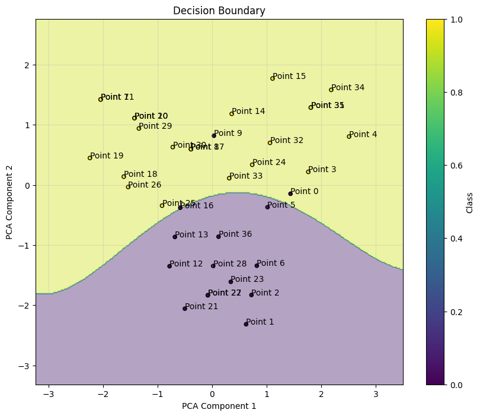
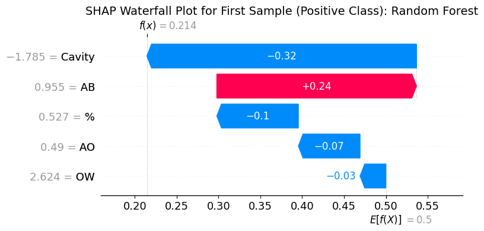

# Microgels
# Классификация устойчивости полости в амфифильных микрогелях

[](https://colab.research.google.com/drive/1kr7y6edO0qYhGnV0qVMb435jLeGyiW6n)

## Аннотация
Микрогели представляют собой важный класс полимерных материалов с широким спектром применения в медицине, фармакологии и биотехнологии. Данная работа представляет модель машинного обучения для классификации микрогелей на основе наличия или отсутствия полости, что существенно влияет на их функциональные характеристики. Модель демонстрирует высокую точность (F1-score = 0.96) при прогнозировании устойчивости полости на основе физико-химических параметров.

**Ключевые слова**: Амфифильные микрогели, межфазная граница, диссипативная динамика частиц, полые микрогели, классификация, машинное обучение

## Введение
Микрогели - мягкие, сшитые коллоидные сетки, демонстрирующие уникальное поведение на межфазных границах. Наличие полости существенно влияет на степень деформации и функциональные характеристики материала. В данной работе представлен подход к разработке модели машинного обучения для автоматической классификации микрогелей на основе их физико-химических параметров, полученных методом диссипативной динамики частиц (ДДЧ).

## Установка и требования

### Зависимости
Установите необходимые зависимости:
```bash
pip install -r requirements.txt
```

### Структура репозитория
```
├── data/               # Примеры данных и образцы
│   └── microgels_data.csv
├── examples/           # Демонстрация результатов
│   ├── decision_boundary.png
│   └── feature_importance.png
├── weights/            # Веса обученных моделей
│   └── random_forest_model.pkl # Лучшая модель при LOO-валидации - Random Forest 
├── notebooks/          # Jupyter/Colab блокноты
│   └── microgels_classification.ipynb
├── scripts/            # Вспомогательные скрипты
│   ├── visualize_results.py
│   └── shap_analysis.py
├── README.md           # Описание проекта
├── requirements.txt    # Список зависимостей

```


## Структура данных
Набор данных содержит 37 образцов с 6 признаками:

| Признак | Описание |
|---------|----------|
| `cav`   | Относительный размер полости |
| `aOW`   | Параметры взаимодействия двух жидкостей |
| `aAB`   | Параметры взаимодействия гидрофобных и гидрофильных сегментов |
| `aAO`   | Параметры взаимодействия гидрофильных сегментов с органической фазой |
|  `%`    | Процент гидрофильных сегментов |

**Целевая переменная**:
- `1`: полость присутствует
- `0`: полость отсутствует

Распределение классов:
- Класс 1 (полость присутствует): 22 образца (59.5%)
- Класс 0 (полость отсутствует): 15 образцов (40.5%)

## Результаты

### Сравнение моделей при кросс-валидации (5 фолдов, с аугментацией SMOTE)
Для сравнения приведём результаты на аугментированных данных (100 образцов после SMOTE):
| Модель               | F1-score | ROC-AUC | Точность (Accuracy) |
|----------------------|----------|---------|---------------------|
| Логистическая регрессия | 0.923    | 1.000   | 0.900               |
| Random Forest       | 0.923    | 1.000   | 0.900               |
| XGBoost              | 0.923    | 1.000   | 0.900               |
| SVM                  | 1.000    | 1.000   | 1.000               |
| Наивный Байес        | 0.9091   | 1.000  | 0.9000   |
| Stacking Ensemble    | 0.923    | 1.000   | 0.900               |

### Сравнение моделей при LOO-валидации 

| Модель               | F1-score | ROC-AUC | Точность (Accuracy) |
|----------------------|----------|---------|----------|
| Логистическая регрессия | 0.7458   | 0.7030  | 0.5946   |
| Random Forest        | 0.9565   | 0.9939  | 0.9459   |
| XGBoost              | 0.8980   | 0.9606  | 0.8649   |
| SVM                  | 0.9333   | 0.9545  | 0.9189   |
| Наивный Байес        | 0.9000   | 0.9545  | 0.8919   |
| Stacking Ensemble**| 0.9545| 0.9848| 0.9459 |

### Визуализации

#### Границы решений (PCA) для SVM при кросс-валидации (5 фолдов, с аугментацией SMOTE)


#### Важность признаков для Random Forest при LOO-валидации 


## Анализ результатов

### 1. Влияние дисбаланса классов и аугментации, эффективность SMOTE
- **Проблема дисбаланса**: Исходные данные имели соотношение классов 1.47:1 (22:15):
  - Значительное улучшению после SMOTE (F1=0.923)
  - Увеличение количество образцов класса 0 с 15 до 50
  - Для tree-based моделей дала умеренное улучшение (+3-8% F1)

### 2. Устойчивость моделей к малым размерам выборки
**Random Forest показал исключительную устойчивость**:
- Наивысшие результаты на исходных данных (F1=0.9565)
- Сохранил лидерство в ансамблевых методах
- Менее чувствителен к дисбалансу классов

**Сравнение подходов к валидации**:
| Метод валидации | Преимущества | Недостатки | Лучшая модель |
|-----------------|--------------|------------|---------------|
| LOO (n=37)      | Максимальное использование данных | Высокая вычислительная сложность | Random Forest |
| 5-fold CV (n=100) | Стабильность оценок | Зависимость от аугментации | Логистическая регрессия |

### 3. Интерпретация важности признаков
Анализ SHAP-значений выявил ключевые факторы устойчивости полости:

1. **aAB (взаимодействие сегментов)**:
   - Наиболее значимый признак во всех моделях
   - Высокие значения (>35) коррелируют с сохранением полости
   
2. **aAO (взаимодействие с органикой)**:
   - Критический параметр для микрогелей на границе жидкость-жидкость
   - Оптимальный диапазон: 40-45

3. **cav (размер полости)**:
   - Нелинейная зависимость
   - Полости среднего размера (0.5-0.6) наиболее стабильны

## Выводы
1. Доказана эффективность ML для прогнозирования устойчивости полости: разработана модель с F1-score = 0.96
2. Важнейшие признаки: 
   - Параметры взаимодействия сегментов микрогеля (aAB)
   - Взаимодействие с органической фазой (aAO)
3. Модель открывает путь к целенаправленному синтезу амфифильных микрогелей со стабильной полостью

## Ссылки
- [Colab ноутбук](https://colab.research.google.com/drive/1kr7y6edO0qYhGnV0qVMb435jLeGyiW6n)
- [Полный код проекта](https://github.com/Sofia-Kud/Microgels)

## Литература
1. Karen Geisel, Andrey A. Rudov, Igor I. Potemkin, and Walter Richtering, Langmuir 2015, 31, 13145−13154.
2. Rustam A. Gumerov, Sergei A. Filippov, Walter Richtering, Andrij Pich and Igor I. Potemkin, Soft Matter, 2019, 15, 3978−3986.

---
**Автор**: София Кудряшова  
**Дата**: Июнь 2025
