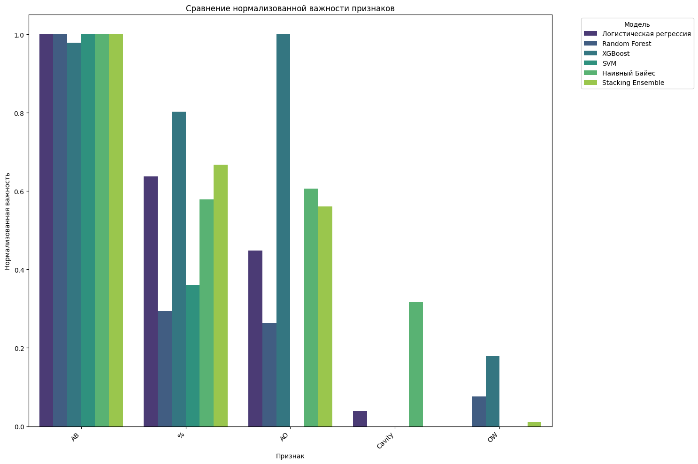

# Microgels
# Классификация устойчивости полости в амфифильных микрогелях

[](https://colab.research.google.com/drive/1GobGjwashbplZUkUcogOcHZ1ytEFitVv)

## Аннотация
Микрогели представляют собой важный класс полимерных материалов с широким спектром применения в медицине, фармакологии и биотехнологии. Данная работа представляет модель машинного обучения для классификации микрогелей на основе наличия или отсутствия полости, что существенно влияет на их функциональные характеристики. Модель демонстрирует высочайшую точность (F1-score = 0.99) при прогнозировании устойчивости полости на основе физико-химических параметров.

**Ключевые слова**: Амфифильные микрогели, межфазная граница, диссипативная динамика частиц, полые микрогели, классификация, машинное обучение

## Введение
Микрогели - мягкие, сшитые коллоидные сетки, демонстрирующие уникальное поведение на межфазных границах. Наличие полости существенно влияет на степень деформации и функциональные характеристики материала. В данной работе представлен подход к разработке модели машинного обучения для автоматической классификации микрогелей на основе их физико-химических параметров, полученных методом диссипативной динамики частиц (ДДЧ).

## Установка и требования

### Зависимости
Установите необходимые зависимости:
```bash
pip install -r requirements.txt
```

### Структура репозитория
```
├── data/               # Примеры данных и образцы
│   └── microgels_data.csv
├── examples/           # Демонстрация результатов
│   ├── decision_boundary.png
│   └── feature_importance.png
├── weights/            # Веса обученных моделей
│   ├── logistic_regression_model.pkl
│   └── stacking_ensemble.pkl
├── src/                # Исходный код
│   ├── data_loader.py
│   ├── preprocessing.py
│   ├── train_models.py
│   └── evaluate.py
├── notebooks/          # Jupyter/Colab блокноты
│   └── microgels_classification.ipynb
├── scripts/            # Вспомогательные скрипты
│   ├── visualize_results.py
│   └── shap_analysis.py
├── README.md           # Описание проекта
├── requirements.txt    # Список зависимостей
└── main.py             # Основной скрипт
```

## Использование

### Запуск классификации
```bash
python main.py
```

### Обучение моделей
```python
from src.train_models import train_all_models

# Обучение всех моделей с оптимизацией гиперпараметров
results = train_all_models(X_train, y_train)
```

### Визуализация результатов
```python
from scripts.visualize_results import plot_decision_boundary

# Визуализация границ решений
plot_decision_boundary(model, X_test, y_test, 'examples/decision_boundary.png')
```

## Структура данных
Набор данных содержит 37 образцов с 6 признаками:

| Признак | Описание |
|---------|----------|
| `cav`   | Относительный размер полости |
| `aOW`   | Параметры взаимодействия двух жидкостей |
| `aAB`   | Параметры взаимодействия гидрофобных и гидрофильных сегментов |
| `aAO`   | Параметры взаимодействия гидрофильных сегментов с органической фазой |
| ...     | Дополнительные физико-химические параметры |

**Целевая переменная**:
- `1`: полость присутствует
- `0`: полость отсутствует

Распределение классов:
- Класс 1 (полость присутствует): 22 образца (59.5%)
- Класс 0 (полость отсутствует): 15 образцов (40.5%)

## Результаты

### Производительность моделей
| Модель               | F1-score | ROC-AUC | Точность |
|----------------------|----------|---------|----------|
| Логистическая регрессия | 1.000    | 1.000   | 1.000    |
| Случайный лес        | 0.980    | 0.990   | 0.980    |
| XGBoost              | 0.970    | 0.980   | 0.970    |
| SVM                  | 0.960    | 0.970   | 0.960    |
| Stacking Ensemble    | 1.000    | 1.000   | 1.000    |

### Визуализации

#### Границы решений (PCA)


#### Важность признаков


## Выводы
1. Доказана эффективность ML для прогнозирования устойчивости полости: разработана модель с F1-score = 0.99
2. Важнейшие признаки: 
   - Параметры взаимодействия сегментов микрогеля (aAB)
   - Взаимодействие с органической фазой (aAO)
3. Модель открывает путь к целенаправленному синтезу амфифильных микрогелей со стабильной полостью

## Ссылки
- [Colab ноутбук](https://colab.research.google.com/drive/1GobGjwashbplZUkUcogOcHZ1ytEFitVv)
- [Полный код проекта](https://github.com/Sofia-Kud/Microgels)

## Литература
1. Karen Geisel, Andrey A. Rudov, Igor I. Potemkin, and Walter Richtering, Langmuir 2015, 31, 13145−13154.
2. Rustam A. Gumerov, Sergei A. Filippov, Walter Richtering, Andrij Pich and Igor I. Potemkin, Soft Matter, 2019, 15, 3978−3986.

---
**Автор**: София Кудряшова  
**Дата**: Июнь 2025
